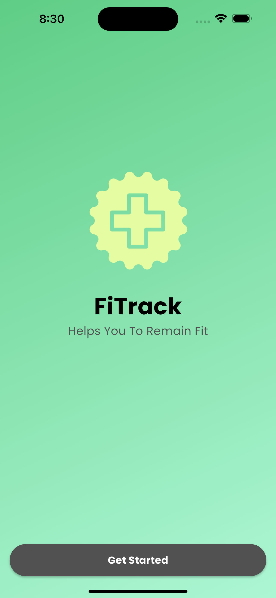
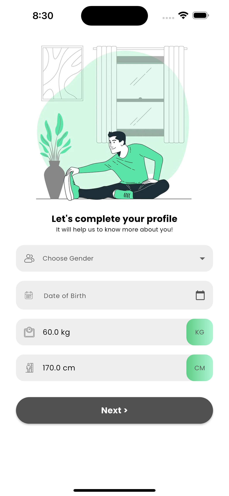

# FiTrack App

FiTrack is a fitness companion application designed to help users stay fit by tracking their profile details, setting goals, and providing a smooth onboarding experience.

## Features

* **Splash Screen with Animated Logo**: A welcoming splash screen featuring the FiTrack logo that performs a quick 360-degree rotation animation upon app launch.
* **Onboarding Screens**: Guides new users through initial setup.
* **Complete Profile Section**:
    * Allows users to input personal details such as Gender, Date of Birth, Weight, and Height.
    * Interactive pickers for weight and height selection.
    * Validation for required fields.
    * Custom styling for input fields (e.g., icons, rounded containers).
    * Improved readability with bold text for section titles.
    * Cleaned numeric displays for weight and height (removed "kg" and "cm" units from the displayed number itself, while retaining the unit labels on the side).
* **Navigation**: Seamless transition to the Goal Setting screen after profile completion.
* **Gradient Backgrounds**: Visually appealing linear gradients for certain sections.

## Screenshots

| Splash/Started View (Animated Logo) | Complete Profile View |
| :---------------------------------- | :-------------------- |
|  |  |

*(Note: The `FiTrackLogo.png` file is the animated logo)*

## Getting Started

These instructions will get you a copy of the project up and running on your local machine for development and testing purposes.

### Prerequisites

Before you begin, ensure you have the following installed on your system:

* [Flutter SDK](https://flutter.dev/docs/get-started/install)
* [Git](https://git-scm.com/book/en/v2/Getting-Started-Installing-Git)

### Installation

1.  **Clone the repository:**
    ```bash
    git clone https://github.com/rej43/fitrack_new.git
    cd FiTrack
    ```

2.  **Install dependencies:**
    Navigate to the project root and run:
    ```bash
    flutter pub get
    ```

3.  **Ensure assets are configured:**
    Verify your `pubspec.yaml` file includes the `assets` folder:
    ```yaml
    flutter:
      uses-material-design: true
      assets:
        - assets/
        - assets/img/ # If you have images in assets/img/
    ```
    After modifying `pubspec.yaml`, always run `flutter pub get` again.

### Running the App

To run the app on a connected device or emulator:

```bash
flutter run