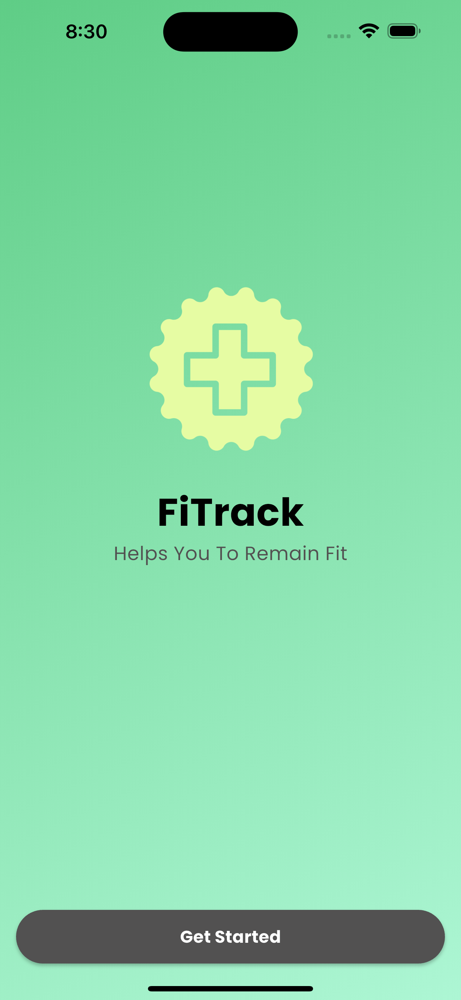
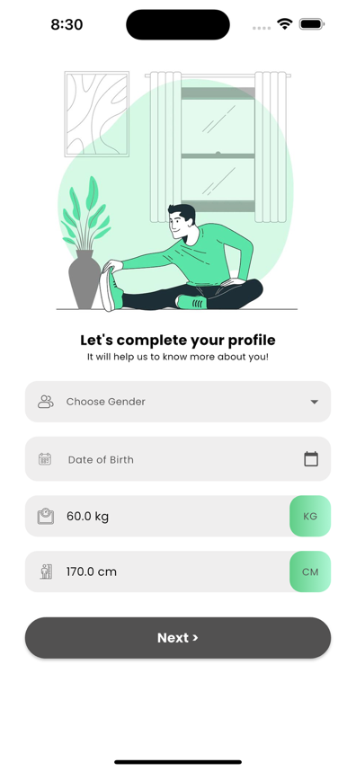

# FiTrack — Health & Fitness Tracking App


FiTrack is a cross-platform fitness app built with Flutter. It helps users track daily
activity — steps, calories, sleep, and water — set personal goals, and view their progress
through charts. It is backed by a TypeScript/Express REST API with MongoDB.

---

## Features

- **Onboarding & profile setup** — gender, date of birth, weight, height with interactive pickers and validation
- **Activity tracking** — steps (via device pedometer), calories, sleep, and water intake
- **Goal setting** — set targets and track progress against them
- **Dashboard** — daily activity overview with progress visualisation
- **Charts & reports** — built with `fl_chart` and Syncfusion charts
- **Authentication** — email/password (JWT) and Google sign-in
- **Admin dashboard** and a basic community view

---

## Tech Stack

**Mobile (Flutter / Dart)**
- `pedometer` — real step counting
- `fl_chart`, `syncfusion_flutter_charts` — graphs
- `shared_preferences` — local storage
- `permission_handler`, `image_picker`, `http`

**Backend (Node + TypeScript)**
- Express 5
- MongoDB with Mongoose + Typegoose
- JWT auth + `bcryptjs` password hashing
- Google OAuth via Passport (`passport-google-oauth20`)
- Zod for request validation, `express-rate-limit`, `morgan` logging

---

## Project Structure

```
fitrack_new/
├── lib/                 # Flutter app
│   ├── view/            # screens (login, home, activity, profile, community, admin)
│   ├── common_widget/   # reusable widgets
│   ├── services/        # api_service, data_sync_service
│   └── models/
├── backend/             # Express + TypeScript API
│   └── src/
│       ├── controllers/ routes/ services/ models/
│       ├── middlewares/  config/  zod/  utils/
│       └── index.ts
├── assets/
└── Screenshots/
```

---

## Getting Started

### 1. Mobile app

```bash
git clone https://github.com/rej43/fitrack_new.git
cd fitrack_new
flutter pub get
flutter run
```

### 2. Backend API

```bash
cd backend
npm install        # or: bun install
cp .env.sample .env   # then fill in MONGODB_URI, JWT secret, Google OAuth keys
npm run dev
```

See `backend/SETUP.md` for full backend configuration.

---

## Screenshots

| Splash | Complete Profile |
|--------|------------------|
|  |  |

---

## Authors

- **Pratik Mishra**
- **Rejisha Bharati**
- **Susmit Karki** — [GitHub @rej43](https://github.com/rej43) · susmitkarki12@gmail.com
- **Swastik Shrestha**
